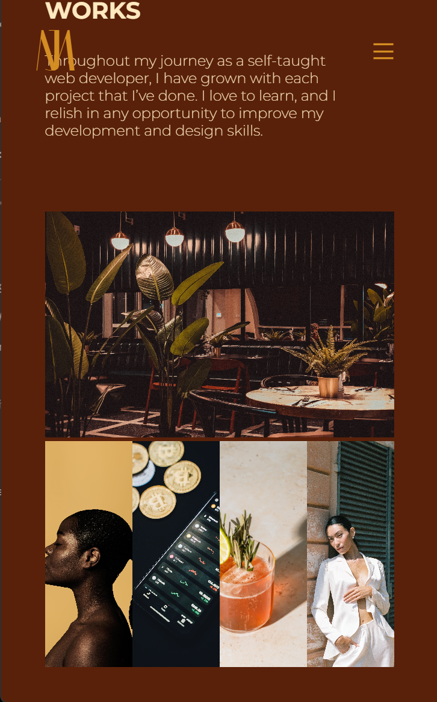

# Jasmine Maduafokwa's Portfolio

## Description

This is my portfolio website for web development, which includes a home, about, works, and contact section. With this portfolio, since I feel that web design is very important when discussing the topic of web development, I also wanted to show my design sense as well. I also made sure that the website was fully responsive in all width sizes. Although I haven't added it in yet, I intend to add scrolling animations later on, but for the sake of achieving the module 2 requirements, I just wanted to show a general idea of what I wanted for my portfolio.

I've been working on my portfolio since before my bootcamp started, and I've changed the design multiple times because I want my portfolio to be perfect, not for the employers but for myself. I'm always trying to come up with new and innovative ways to make my portfolio something that I can say that I'm proud of. I don't want to just make a quick portfolio website. I want it to show my potential and what I believe myself to be capable of. 

For now, I've added the main requirements for a portfolio, but my idea for the works/portfolio section is completely different from what I made it to be, and I plan to add other sections to make my portfolio stand out further. I've shown the general vibe of what I want my portfolio to be, but I also know that I'm going to make it better.

## Usage

Link to deployed application:

https://jmaduafo.github.io/jasmine-maduafokwa-portfolio/portfolio/

You can navigate throughout using the header links, or if working in mobile or iPad width, there is a hamburger menu that can be used to navigate as well. As mentioned above, the site is fully responsive.

This is how the site looks in desktop view for each section:

This is how the site looks in mobile view for each section:

## Credits

The images aren't mine. I used pexels.com for the pictures, and the profile pic is also not me as well. I wanted to use a photo that melds well with the rest of the site. As of now, I don't have any good pictures that I can add into my site, but I plan to add my own picture while I continue to work on my portfolio.

I have used Freecodecamp and Codecademy in the past to help to advance my knowledge on the usage of HTML, CSS, Javascript and other frontend languages and have watched videos by professional developers such as Youtubers Web Dev Simplified, Kevin Powell, and Easy Tutorials for extra learning. For web design inspiration, I've browsed websites like awwwards.com, Behance, Dribble, and watched Youtube videos by Futur to learn better web design practices. Learning from all these people and sites have helped me become a better developer and designer, and I still have a lot to learn in my journey. 

---

## Features

Home Section / 
About Section / 
Works Section / 
Contact Section / 
Footer Section / 
Social links / 
Animation on geometric icon / 
Logo initials animation on hover and scroll

